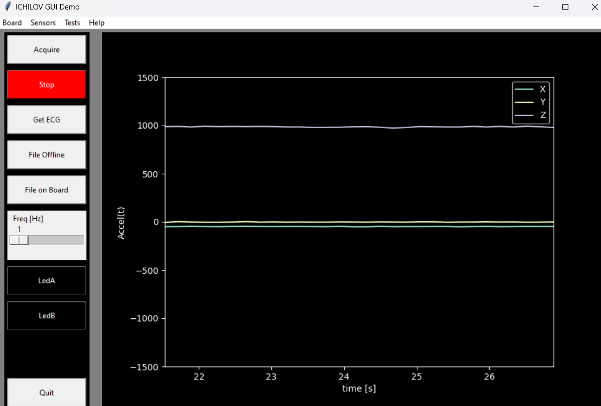
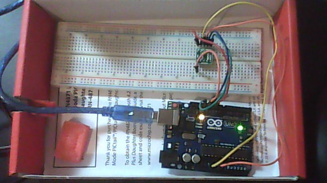

# Python, Arduino and mCube Accelerometer (EV3635)
Basic implementation of the Accelerometer MC3565 interface to Arduino
and python GUI that can receive and display the data in real time from Arduino board.

# Arduino Uno and mCube (MC3635) SPI Connection
Make sure to connect evaluation board EV3635 of MC3635 in the following way:

Connection table:

Name           |  Arduino Uno  | MC3635 
:------------: |  :----------: | :-------------: 
SCLK           |  SCLK 13      | SCL 6
MISO           |  MISO 12      | SDO 1
MOSI           |  MOSI 11      | SDA 7
CS             |  SS   10      | SCS 10
POWER          |  3.3V         | DVDD 9
GND            | GND           | GND 8

# Folder structure
The following information is required:

- Board : contains Arduino modules and communication interface
- PC    : Contains GUI and Communication wrapper that sends string messages to and from Arduino using COM interface.

# Installation on Windows

1. Install python 3.10 from Python Release Python 3.10.0 | https://www.python.org

2. Create virtual environment. In Windows PowerShell:

    python -m venv \Envs\pyqt

3. Activate virtual environment. In Windows CMD shell:

    \Envs\pyqt\Scripts\activate.bat

4. Install serial and numpy:

    pip install serial

5. Instrall PySide6 library (requires also Clang library (C-bindings) see : https://pypi.org/project/PySide6/):

    pip install PySide6

6. Install QtGraph:

    pip install pyqtgraph

# Special thanks
The code is based on the library provided by:

https://github.com/cphuangf/Accelerometer_MC3635

https://github.com/mcubemems/mCube_mc36xx_mcu_driver/tree/master

# Versions

 Ver  | Date         | Who   | Descr
:---: | :----------: | :---: |:-------------: 
0105  | 01.12.22     | UD    | Addign Accel

